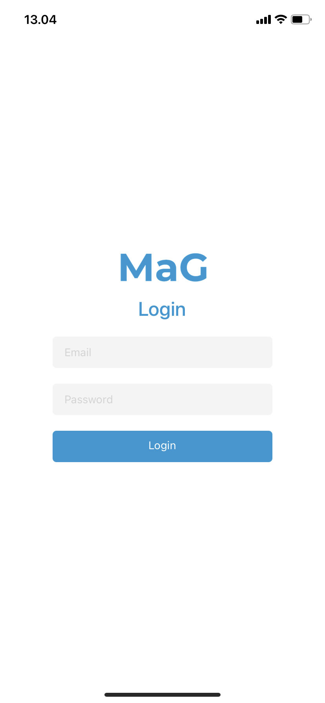
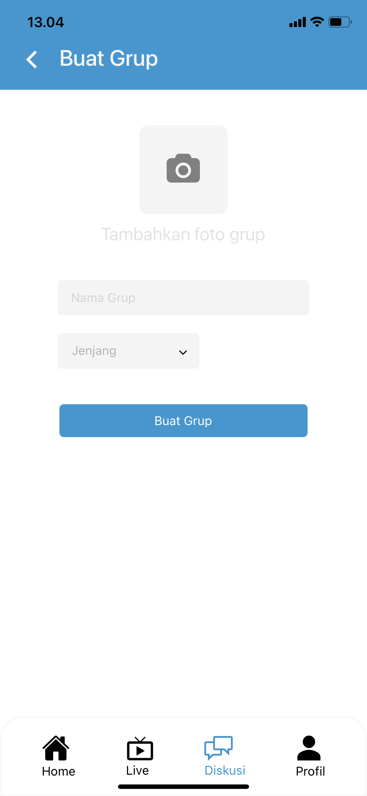
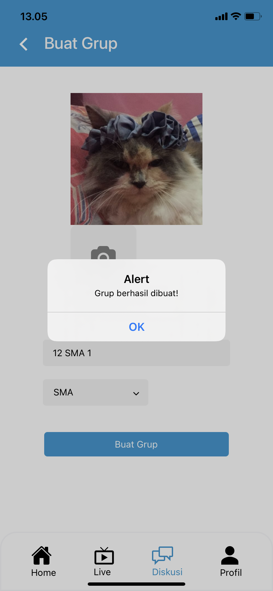

# MAKE A GROUP APP
##### Build with React Native (EXPO)

### App Screenshot
<p float="left">
  
  
  
</p>

### App Installation
1. Clone from GitHub
```
git clone https://github.com/afifadayu/make-a-group.git
cd make-a-group\app
```

2. Installing node.js
> https://nodejs.org/en/download/

3. Download Expo on **App Store** or **Google Play Store** and login

4. Installing Expo in Terminal
```
yarn install expo-cli --global
```

4. Run Project with Terminal 
```
expo start
```

### APK Link (Android Only): http://bit.ly/make-a-group-apk

Made with ♡ by Dayu.
